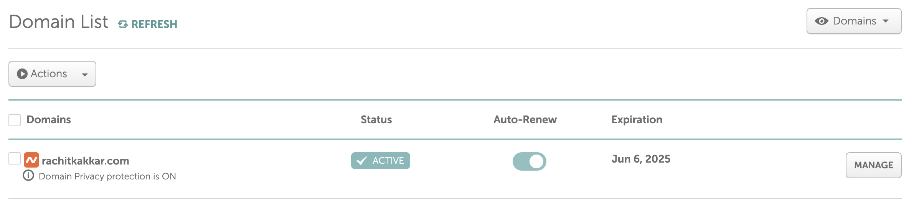

A picture I took of the skyline in Osaka, Japan in 2024

I've attempted a blog on and off ever since my computer science teacher suggested that I should start one back in 7th grade. While none of these attempts have proven fruitful in the long run, the culmination of several factors---including the rapid arrival of a new year, the relative freedom of second semester senior year, and the rapidly approaching onset of adulthood---have all dramatically coalesced to inspire me to try my hand at it one last time. Of course, I've been particularly inspired by the development of a newfound interest in writing and rhetoric brought about by reading books such as *Frankenstein*, *Narrative of the Life of Frederick Douglass*, and *Man's Search for Meaning*---in addition to foundational documents in AP US Government and (perhaps most appropriately) some interesting blog posts over at mitadmissions.org, Nate Silver's Silver Bulletin, and thisibelive.org. Where I used to dismiss writing in favor of a more STEM-focused pursuit of technology and engineering, I've now come to realize the power of the written and spoken word. Assembly may have landed the Apollo spacecraft, but it was Kennedy's speech that inspired men to do so great a thing[^1].

With that said, I won't make any promises about the future content of this blog; frankly, I don't even know. My last attempts almost entirely focused on my technical endeavors, and I'll surely continue that trend in many a blog to come, but I'm tempted to explore a wider ranger topics pertaining to my multifaceted interests this time around. Perhaps my intentions are, on a fundamental level, *selifish*---part of a Maslowian desire to self-actualize or to prove that I, for a fleeting moment, was really *here*, with all the rabbit holes I've fallen into, all the insights I've discovered, and all the values I hold dear. At the very least, taking some time to write, self-reflect, and chronicle in the present might prove to be the best antidote to the uncertainty of the future. I'm reminded of the quote oft attributed to Ralph Waldo Emerson (though he probably didn’t say it):

What lies behind us and what lies ahead of us are tiny matters compared to what lies within us.

In writing these posts, I hope to go *within*, reflecting on my unique experiences and designing lasting principles in a way that leave little room for worry about what may lie *ahead*. And who knows? Maybe someone, *somewhere* will derive some value from this little venture of mine.

## Website Details
I find it be only natural, for my first post, to indulge in a *brief* explanation of how I built this blog in the first place. The biggest component of the so-called "stack" is Hugo, which is used to generate a static website that is then hosted (for *free!*) on GitHub pages[^2]. In fact, the only cost associated with running my little place on the great World Wide Web is the domain, which I pay Namecheap ~~$11.28~~ $16.68 a year for.



In terms of static site generators, I found Hugo felt lighter and faster that Jeykll, while remaining more verstaile and documented then Eleventy (at least at the last time I used it, years ago...). I don't use a theme, so the task of making things look "good" is handled by Tailwind CSS through in-line classes in the different Hugo layouts, as shown in this code snippet from the single page layout (i.e. the layout for this very post):
```
{{ define "main" }}
<div class="bg-white dark:bg-zinc-800 mx-3 sm:mx-[5%] md:mx-[10%] lg:mx-[15%] my-9">
    <h1 class="text-4xl font-bold tracking-tight text-gray-900 dark:text-gray-100 sm:text-6xl">{{ .Title }}</h1>
    <p class="text-md tracking-tight text-gray-600 dark:text-gray-300 sm:text-2xl pt-2">{{ .Params.summary }}</h2>
    </img>
    <div class="mt-6 text-lg text-justify leading-8 text-gray-600 dark:text-gray-300">{{ .Content }}</div>
</div>
{{ end }}
```

Tailwind's inline classes make it easy to make the website responsive () and add a dark mode (). Since, I use Hugo, I wThe actual functionality of the dark mode button, meanwhile, is handled with a bit of client-side JavaScript:
```
// Dark mode
var darkMode;

if (localStorage.theme === "dark" || !("theme" in localStorage)) {
  document.getElementById("moon").classList.add("hidden");
  document.getElementById("sun").classList.remove("hidden");

  document.getElementById("light-theme").setAttribute("disabled", "disabled");

  document.documentElement.classList.add("dark");
  darkMode = true;
} else {
  document.getElementById("moon").classList.remove("hidden");
  document.getElementById("sun").classList.add("hidden");

  document.getElementById("dark-theme").setAttribute("disabled", "disabled");
  
  document.documentElement.classList.remove("dark");
  darkMode = false;
};

function toggleDarkMode() {
  if (darkMode) {
    document.getElementById("moon").classList.remove("hidden");
    document.getElementById("sun").classList.add("hidden");

    document.getElementById("light-theme").removeAttribute("disabled");
    document.getElementById("dark-theme").setAttribute("disabled", "disabled");

    darkMode = false;
    document.documentElement.classList.remove("dark");
    localStorage.theme = "light";
  }

  else if (!darkMode) {
    document.getElementById("moon").classList.add("hidden");
    document.getElementById("sun").classList.remove("hidden");

    document.getElementById("light-theme").setAttribute("disabled", "disabled");
    document.getElementById("dark-theme").removeAttribute("disabled");

    darkMode = true;
    document.documentElement.classList.add("dark");
    localStorage.theme = "dark";
  }
}

document.getElementById("theme-switcher").addEventListener("click", toggleDarkMode);
```

To aid with the responsiveness of it all, there is a collapseable "hamburger" menu that is also handleded with a few lines of JavaScript, as show in this code highlight:
```
// Navbar
var collapsed = true;

function toggleNavbar() {
  if (collapsed) {
    document.getElementById("menu-list").classList.remove("hidden");
    document.getElementById("theme-button").classList.remove("hidden");

    collapsed = false;
  }

  else if (!collapsed) {
    document.getElementById("menu-list").classList.add("hidden");
    document.getElementById("theme-button").classList.add("hidden");

    collapsed = true;
  }
}

document.getElementById("navbar-toggle").addEventListener("click", toggleNavbar);
```

Speaking of code highlighting, I use highlight.js with the 
The only JavaScript that is really needed is for managing the menu, dark mode, and code highlights

[^1]: Well... that and the Cold War...
[^2]: I do plan to set up a Cisco server I've acquired, opening the door to hosting things like a mail or Git server on this domain in the near future
