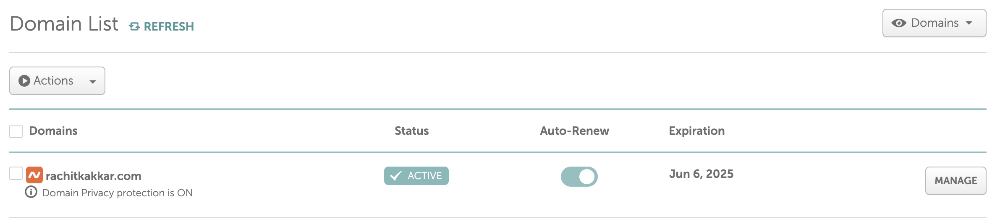
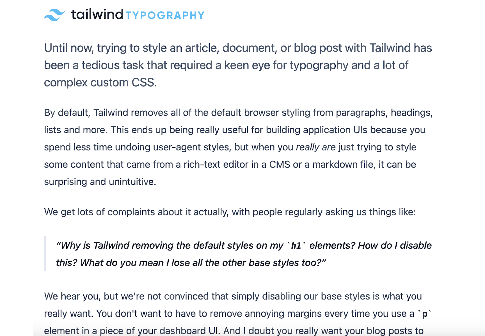

I find it be only natural, for my first technical post, to entertain a brief explanation of how I built this blog in the first place. For maximum control, I've decided to build my own website from scratch instead of rolling out a WordPress instance or similar prepacked alternative. The biggest component of the so-called 'stack' is Hugo, which is used to generate a static website that is then hosted (for *free!*) on GitHub pages[^1].

Static keeps it simple. Static keeps it fast. But, most importantly, static keeps it cheap. In fact, the only cost associated with running my little place on the great World Wide Web is the domain, which I pay Namecheap ~~$11.28~~ $16.68 a year for.



In terms of static site generators, Hugo felt lighter and faster that Jeykll, while remaining more verstaile and documented then Eleventy (at least at the last time I used it). I don't use a theme, so the task of making things look 'good' is handled by Tailwind CSS through in-line classes in the different Hugo layouts, as shown in this code snippet from the single page layout (i.e. the layout for this very post)[^2]: 

```
{{ define "main" }}
<div class="bg-white dark:bg-zinc-800 mx-3 sm:mx-[5%] md:mx-[10%] lg:mx-[15%] my-9">
  <h1 class="text-4xl font-bold tracking-tight text-gray-900 dark:text-gray-100 sm:text-6xl mb-3">{{ .Title }}</h1>
  <p class="text-base tracking-tight text-gray-600 dark:text-gray-300 sm:text-2xl mb-3">{{ .Params.summary }}</p>
  </img>
  <p class="text-sm font-serif text-gray-600 dark:text-gray-300 sm:text-base mt-3 mb-5">{{ .Params.thumbnail_caption }}</p>
  <div class="text-lg text-justify leading-8 text-gray-600 dark:text-gray-300 content">{{ .Content }}</div>
</div>
{{ end }}
```

These pre-existing utility classes make styling much easier out of the box in comparison to writing custom CSS. The end 
result is also more consistent, because I'm using the same utility classes and styles everywhere. Moreover, Tailwind's inline classes make it rather trivial to make the website responsive and add a dark mode. Responsiveness is baked right in using sensible breakpoint prefixes like `sm:`, `md:`, `lg:`, which trigger the specific labeled styles after the window goes past a certain minimum width. Meanwhile, Tailwind uses the `dark:` prefix to define styles that only activate when dark mode is enabled, which is done in this specific website by adding the `dark` class to the body of the page.

The actual functionality of the dark mode button, meanwhile, is handled with a bit of client-side JavaScript:

```
// index.js

// Dark mode
var darkMode;

if (localStorage.theme === "dark" || !("theme" in localStorage)) {
  document.getElementById("moon").classList.add("hidden");
  document.getElementById("sun").classList.remove("hidden");

  document.getElementById("light-theme").setAttribute("disabled", "disabled");

  document.documentElement.classList.add("dark");
  darkMode = true;
} else {
  document.getElementById("moon").classList.remove("hidden");
  document.getElementById("sun").classList.add("hidden");

  document.getElementById("dark-theme").setAttribute("disabled", "disabled");
  
  document.documentElement.classList.remove("dark");
  darkMode = false;
};

function toggleDarkMode() {
  if (darkMode) {
    document.getElementById("moon").classList.remove("hidden");
    document.getElementById("sun").classList.add("hidden");

    document.getElementById("light-theme").removeAttribute("disabled");
    document.getElementById("dark-theme").setAttribute("disabled", "disabled");

    darkMode = false;
    document.documentElement.classList.remove("dark");
    localStorage.theme = "light";
  }

  else if (!darkMode) {
    document.getElementById("moon").classList.add("hidden");
    document.getElementById("sun").classList.remove("hidden");

    document.getElementById("light-theme").setAttribute("disabled", "disabled");
    document.getElementById("dark-theme").removeAttribute("disabled");

    darkMode = true;
    document.documentElement.classList.add("dark");
    localStorage.theme = "dark";
  }
}

document.getElementById("theme-switcher").addEventListener("click", toggleDarkMode);
```

Essentially, this little snippet of code switches between the sun and moon icon in the navigation bar, enables/disables dark mode, and adds the current theme to local storage so it can persist across sessions (which is a fancy way of saying each time the user visits the webpage). All this JavaScript and CSS is kept in the `static/` directory, along with other global assets like images. The reasoning behind this is purely because Hugo directly copies the contents of this directory into the root folder of the generated site (which is `public/` by default), so I can link to these files directly in my `baseof.html` layout --- and, by extension, every page on the website --- by prefacing my links with a `/` to permalink the root/access a file from its absolute path:

```
<!-- baseof.html -->

<!-- Highlight JS -->
<link id="light-theme" rel="stylesheet" href="/highlight/styles/github.min.modified.css">
<link id="dark-theme" rel="stylesheet" href="/highlight/styles/github-dark-dimmed.min.css">

<script src="/highlight/highlight.min.js"></script>

<link rel="stylesheet" type="text/css" href="/css/index.css" />
<script src="/js/index.js" defer></script>
```

To further aid with the responsiveness of it all, I use the aforementioned Tailwind inline classes to hide the full navigation bar and showcase a collapseable 'hamburger' menu in its place on mobile devices.

```
<!-- navbar.HTML -->
<div class="block sm:hidden">
  <button id="navbar-toggle" class="flex items-center px-3 py-2 border rounded text-gray-500 dark:text-gray-200 border-gray-300 dark:border-gray-500 hover:text-black hover:border-black">
    <svg class="fill-current h-3 w-3" viewBox="0 0 20 20" xmlns="http://www.w3.org/2000/svg"><title>Menu</title><path d="M0 3h20v2H0V3zm0 6h20v2H0V9zm0 6h20v2H0v-2z"/></svg>
  </button>
</div>
<div id="menu-list" class="w-full block flex-grow sm:flex sm:items-center sm:w-auto hidden">
  <div class="text-sm sm:flex-grow">
    {{ range .Site.Menus.nav }}
      <a href="{{ .URL }}" class="block mt-4 sm:inline-block sm:mt-0 text-gray-500 dark:text-gray-300 hover:text-black dark:hover:text-white mr-4">
        {{ .Name }}
      </a>
    {{ end }}
  </div>
</div>
```

This does require a few lines of Javascript to show the menu list when the hamburger menu is clicked on:
```
// Navbar
var collapsed = true;

function toggleNavbar() {
  if (collapsed) {
    document.getElementById("menu-list").classList.remove("hidden");
    document.getElementById("theme-button").classList.remove("hidden");

    collapsed = false;
  }

  else if (!collapsed) {
    document.getElementById("menu-list").classList.add("hidden");
    document.getElementById("theme-button").classList.add("hidden");

    collapsed = true;
  }
}

document.getElementById("navbar-toggle").addEventListener("click", toggleNavbar);
```

Another advantage of using a static site generator is that I can just write the posts in Markdown and Hugo automatically generates the corresponding HTML using the layouts I discussed earlier, allowing me to have a decent [separation of concerns](https://en.wikipedia.org/wiki/Separation_of_concerns) between content, website structure, and styling. In accordance with this philosophy, I keep each post and their corresponding assets in separate folders, leading to a directory structure similar to the following[^3]:
```
content/
├── about
│   └── index.md
├── posts
│   ├── my-post
│   │   ├── content-1.md
│   │   ├── content-2.md
│   │   ├── image-1.jpg
│   │   ├── image-2.png
│   │   └── index.md
│   └── my-other-post
│       └── index.md
```

Markdown also has an advantage of keeping my blog posts in a decently portable format (unlike something like WordPress), so I can easily switch to another platform down the line (Substack does seem to be pretty popular these days).

However, while writing blog posts in plain-text --- or at least a very-lightweight markup language --- is convenient, I lose control of the ability to style my content directly as the generated HTML lacks Tailwind's inline classes. This is especially problematic because Tailwind strips away the default margins of most elements, leading to situations where all the text in a post clumps together in one big paragraph because there is no spacing between the different HTML elements (especially the paragraph `<p>` elements). In order to solve this, I initially turned to Hugo feature called *shortcodes*, since Hugo --- unlike most other programs that use Markdown files --- does not support HTML in Markdown files by default (though I did eventually enable this behavior). Essentially, shortcodes allowed me to create small HTML templates (stored in `layouts/shortcodes`) which could then be embedded directly in my Markdown content. For example, I could define the following shortcode for a link element (styled with an underline and hover effect using Tailwind):

```
<!-- link.html -->
<a href='{{ .Get "href" }}' class="underline hover:text-gray-800 dark:hover:text-gray-200">{{ .Inner }}</a>
```

Which I could then insert in my Markdown file like so:
```
 here. 
```

Using this trick did indeed result in a properly styled output due to the Tailwind classes in the shortcode, but it was a rather inefficient way of doing so. As I added more and more shortcodes (which required special syntax in the Markdown in order to be used properly) to support things like images, blockquotes, headings, and so on, I was basically creating my own basterized mark-up language that offered none of the benefits of Markdown or HTML. To top it off, I created a `line_break` shortcode (essentially a wrapper for the `<br>` tag) to force a space between my different HTML elements, since I didn't want to create a shortcode for regular text (i.e. `<p>` elements) just to add some margin. My friend correctly pointed out to me that this is an extreme abuse of the line break element, which is meant to be used for line breaks (duh!), not to add spacing.

In order to salvage the mess that I had made, I got rid of all my shortcodes and moved all my Tailwind CSS to an external stylesheet file. This gets rid of the inline class concept, but with my shortcode madness, I wasn't really making proper use of it anyway[^4]. Plus, I still get to keep the sensible color schemes, responsive breakpoints, and the other quality of life improvements Tailwind brings to the table.

The Tailwind CSS (with its special syntax) styling for the content is now written in the `input.css` file, while the actual vanilla CSS used by the static webpage is stored in `index.css`. Conversion between the two is handled with [npm](https://www.npmjs.com/) and the following command[^5]:

`
npx tailwindcss -i ./static/css/input.css -o ./static/css/index.css --jit --watch
`

For clarity, here is a short excerpt from the `input.css` file demonstrating how the HTML generated from my Markdown content is styled (which I wrapped in the `.content` class):

```
/* input.css */
.content img {
  @apply w-full py-4;
}

.content p {
  @apply font-serif text-gray-600 dark:text-gray-300;
}

.content > p:first-of-type:first-letter {
  @apply text-rose-500 dark:text-rose-300 float-left text-7xl pr-4 font-black;
}

.content a {
  @apply text-rose-500 dark:text-rose-300 underline;
}

.content ol {
  @apply list-decimal list-inside font-serif text-gray-500 dark:text-gray-400 p-3;
}
```

Now, later on I eventually encountered the [Tailwind CSS Typography plugin](https://github.com/tailwindlabs/tailwindcss-typography), which "provides a set of prose classes you can use to add beautiful typographic defaults to any vanilla HTML you don’t control, like HTML rendered from Markdown, or pulled from a CMS." In laymen's terms, that essentially means there was a plugin I could have been using this entire time which would have handled styling the HTML generated from my Markdown posts automatically by adding a single `prose` class, saving me the ~50 lines of custom CSS I wrote to do it manually. Despite the time I technically wasted, I'm glad to know that the problems I encountered have been faced by other smart people and have an interesting avenue to pursue for a future update to this site. At the very least, I have another tool to stash in my website-building toolbox in the (unlikely) case I need to build another article based website.


Tailwind typography demo


An astute reader who was paying close attention may have noticed earlier that I linked to something known as [hilight.js](https://highlightjs.org/) in my `baseof.html` file. The reason comes down to the dark mode functionality I implemented. While Hugo does have syntax highlighting by default (and I believe it is possible to switch the theme between a light and dark theme), higlight.js makes the switching behavior stupid easy. I just need to link the respective themes for light and dark mode with these two lines of HTML:

```
<!-- baseof.html -- >

<link id="light-theme" rel="stylesheet" href="/highlight/styles/github.min.modified.css">
<link id="dark-theme" rel="stylesheet" href="/highlight/styles/github-dark-dimmed.min.css">
```

Before enabling the correct theme (and disabling the other one) with the previously unexplained lines of JavaScript that look like this in my `toggleDarkMode()` function:
```
// index.js

document.getElementById("light-theme").removeAttribute("disabled");
document.getElementById("dark-theme").setAttribute("disabled", "disabled");
```

This project was also the first time I set up continuous integration (CI) for a repository on my own. With the current CI pipleine I have, I just need to push the changes to the website source and GitHub will automatically build and publish the public files (which are generated from the Markdown, layouts, and shortcodes I've put together). This was a huge improvement from the website I built for my high school survey club with Eleventy, where I would manually build the public files in a submodule[^6] which was then pushed to a separate branch that GitHub pages would use as the target branch for the site files.

Setting CI up wasn't particularly difficult either. I just copied a `hugo.yaml` workflow I found online into the `.github/workflows` folder.

(Someone remind me to put an image here when I update my website for the first time in 2 years...)

Voilà! That basically wraps up my in-depth explanation of how my website functions. Like most things in life, writing this post took a lot longer than I expected --- so reaching the end feels a *little* surreal. Also like most things in life, it should get easier with consistent practice. I'll see you in the next post.

[^1]: I do plan to set up a Cisco UCS C220 M3 rack server I've recently acquired, opening the door to hosting things like a mail or Git server on this domain in the near future. Still, the cost would still be nothing more than the electricity required to run the thing --- and the noise pollution in my room, because that thing is *loud*.
[^2]: Now, I *could* pretty easily turn this into a custom theme. However, that is pretty unlikely because I like having a unique and handcrafted website.
[^3]: A directory that contains an index.md file and some resources is known as a *leaf bundle* in proper Hugo terminology.
[^4]: I still use shortcodes for more custom elements (most notably captions and quotations)
[^5]: The `--watch` flag allows live updates, so I run it concurrently with my
`hugo serve` command (which launches the Hugo development server) in a separate terminal to allow
for live development.
[^6]: Submodules are a Git feature that allow you to include or embed one or more repositories as a sub-folder inside another repository