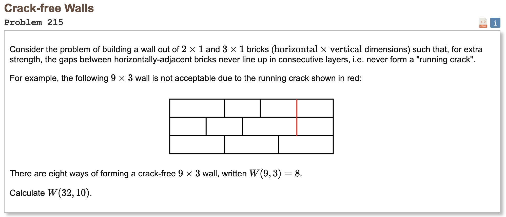

Some time ago, in my high school Discrete Math class[^1], I found myself faced with the following problem:



The naive approach when presented such a problem is simple brute force: comparing every possible permutation of rows against every possible permutation of rows until we find a valid configuration. Then, we repeat the process all over again --- comparing the second row from our valid configuration against all possible permutations to find a valid third row, and so on until reaching our goal of *n* rows (which we can refer to as our depth). And for a small case, that just *might* work. 

Certainly, that was my initial strategy, and I began by writing a function to generate all possible permutations of rows from 2 x 1 and 3 x 1 bricks:
```
def gen_row_permutations(width):
  permutations = []
  def subset(partial=[]):
    nonlocal permutations
    # Calculate all possible subsets give a (partially) complete wall and add to permutation list
    # For example, the incomplete wall [2, 2] has the possible subsets [2, 2, 3, 2] AND [2, 2, 2, 3]
    if (sum(partial) == width): # Wall row is full
      permutations.append(tuple(partial))
      return
    elif (sum(partial) == width-3): # Can only fit an additional 3x1 bricks
      subset([*partial, 3])
    elif (sum(partial) == width-2 or sum(partial) == width-4): # Can only fit one or two additional 2x1 bricks
      subset([*partial, 2])
    else: # Can fit a 3x1 OR a 2x1 brick
      subset([*partial, 2])
      subset([*partial, 3])
  subset()
  return permutations
```

Before writing another function to recursively compare each permutation of rows against every permutation of rows, and then comparing the latter row of that match-up with every permutation of rows all over again[^2] each time I found two rows that were crack free (but not before increasing our current depth by 1). This process would repeat until we reached our desired depth (hence the `if row_count == rows-1` as our recursive base case), upon which I would increment `wall_count` by 1 before moving on to the next possible permutation for that row.
```
def euler215_brute_force(width, rows):
  row_permutations = gen_row_permutations(width)
  wall_count = 0
  walls = []

  @functools.cache
  def recursive_compare(row, depth=1, partial=()):
    nonlocal wall_count

    for permutation in row_permutations:
      if is_crack_free(tuple(row), tuple(permutation)):
        if depth == rows-1:
          wall = (*partial, permutation)
          walls.append(wall)
          wall_count += 1
        else:
          recursive_compare(permutation, depth + 1, partial=(*partial, permutation))

  for permutation in row_permutations:
    recursive_compare(permutation, partial=permutation)

  return wall_count
```

Such a process does indeed work in computing the number of possible crack-wall walls, because we are quite literally generating *all* walls that could ever exist and counting the ones that are valid. But in order to get an idea of how such a method would *scale*, we need some sort of metric. The obvious solution is to use time, but time can mean vastly different things to vastly different people. The same program would hardly take the same time to run on a modern Ryzen 9 7950x3D then a Pentium II, much less running in parallel on the exabyte scale supercomputers of the Texas Advanced Computing Center[^3].

Wow. 

Maybe we need a faster algorithm...[^4]

...

Time and time again, I've found myself marveling at the power of **compounding**. Our little problem from earlier shows how combating exponential growth in complexity has been the sole force behind some of the smartest men and women of our time devoting themselves to the search for better, faster, more efficient, and just downright *clever* algorithms. Beyond that, its also driven nearly a century of computing advancements. One need simply to recall the infamous Moore's law


phones in our pockets are x60 times faster than the computers that took us to the moon

Even now that physics Moore's law has died after running aground against the literal limits of physics, processors still have a way of becoming faster with every passing generation. Imagine where we will be --- *for better or for worse* --- a century from now, given a little incremental progress and the unstoppable march of time!

Perhaps we need not just imagine, as compounding happens to show its power in other domains as well, perhaps most apparently in economics. Warren Buffet, who was once referred to by Fortune magazine as "the wizard of Omaha",

I've found it so *profound* in fact, that I've found a tremendous benefit in making it a central principle in my approach to life itself.

returning to a quote that is often (and likely incorrectly) attributed to Einstein: 

Compound interest is the eighth wonder of the world.


[^1]: At least that's how it's coded on my transcript; it's really a Logic class in the first semester and a Computational Problem-Solving class in the second
[^2]: Maybe now you're starting to see where the inefficiency comes from
[^3]: A place I have been fortunate to visit, and perhaps one of the many reasons I'm seeking to major in electrical/computer engineering
[^4]: I did eventually find [one](CrackFreeWalls.py)


----
